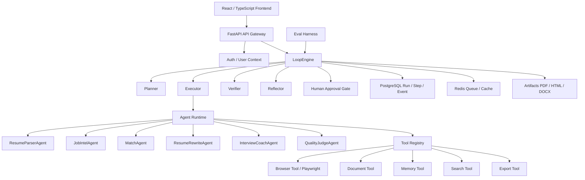

# CareerPilot 项目设计文档：面向实习求职的生产级 AI Agent 工作流平台

## 1. 项目定位

CareerPilot 是一个全 Python 后端 + React/Vue 前端的求职 AI Agent 平台。

它面向学生找实习、校招和转方向求职场景，围绕：

```text
简历解析
→ 岗位解析
→ 岗位匹配
→ 简历定制
→ 投递材料生成
→ 面试准备
→ 反馈复盘
```

构建一个可追踪、可审批、可评测、可恢复的多阶段 Agent 工作流系统。

一句话介绍：

```text
CareerPilot 是一个面向实习求职的 AI Agent Workflow Platform，通过 LoopEngine、多 Agent 协作、浏览器工具、文档生成、人工审批、质量评测和成本追踪，帮助用户完成从岗位分析到定制简历和面试准备的完整求职闭环。
```

## 2. 和 DeepResearch 的差异

| 维度 | DeepResearch | CareerPilot |
|---|---|---|
| 技术主线 | 企业知识库 RAG + Agent | 求职任务型 Agent 工作流平台 |
| 后端语言 | Java | Python |
| 前端 | 简单 demo 页面 | React / Vue 正式前端 |
| 核心能力 | RAG、BM25、RRF、rerank、记忆、Harness | LoopEngine、多 Agent、浏览器工具、文档生成、人工审批、Eval Harness |
| 数据对象 | 文档、chunk、检索结果 | 简历、岗位、匹配报告、投递记录、面试反馈 |
| 演示方式 | 问答和检索调试 | 上传简历、抓岗位、生成定制简历、模拟面试 |
| 简历价值 | Java 后端 + RAG 平台 | Python AI Agent 工程平台 |

这个项目不是再做一个 RAG，而是做“任务执行型 Agent 平台”。

## 3. 核心目标

项目必须满足 5 个目标：

1. **适合找实习展示**：场景天然贴合学生求职，可以现场演示。
2. **全部 AI 后端用 Python**：符合 AI Agent / LLM 应用开发岗位技术栈。
3. **技术深度不低于 DeepResearch**：有 LoopEngine、Agent、工具、评测、状态、成本、审批。
4. **生产级工程味道**：有数据库、队列、trace、idempotency、权限、成本和质量门禁。
5. **不胡编求职经历**：所有简历改写必须 evidence-locked，可追溯到原始简历。

## 4. 推荐技术栈

### 4.1 Backend

```text
Python 3.11+
FastAPI
Pydantic v2
SQLAlchemy 2.0
Alembic
PostgreSQL
Redis
Celery / RQ / Arq
Playwright
BeautifulSoup / Trafilatura
python-docx
Markdown / Jinja2
WeasyPrint or Playwright PDF
LiteLLM or OpenAI-compatible client
SentenceTransformers
FAISS / Qdrant
pytest
Ruff
Docker Compose
```

### 4.2 Frontend

推荐优先使用：

```text
React + Vite + TypeScript + Tailwind CSS + shadcn/ui
```

原因：

- AI 工具类产品生态成熟；
- 组件库丰富；
- 适合做 dashboard、step trace、diff view、artifact preview；
- 简历上 React + TypeScript 也更通用。

Vue 备选：

```text
Vue 3 + Vite + TypeScript + Element Plus
```

如果你想更快做出后台管理页面，可以用 Vue + Element Plus；如果想更接近现代 AI SaaS 产品，建议 React。

本文档默认采用：

```text
Frontend = React + TypeScript
Backend = Python + FastAPI
```

### 4.3 Model/API

预算 200 元以内，建议：

```text
DeepSeek：主力规划、解析、改写、总结
OpenAI：少量高质量 judge / 终审
本地 BGE / E5：embedding
本地 bge-reranker：必要时做 evidence rerank
Tavily / Exa：可选岗位搜索 API
```

第一版可以只用 DeepSeek + 本地 embedding，成本最低。

## 5. 总体架构

```text
React Frontend
→ FastAPI Gateway
→ LoopEngine
→ Agent Runtime
→ Tool Registry
→ PostgreSQL / Redis / Object Storage
→ Eval Harness / HTML Report
```



## 6. LoopEngine 设计

CareerPilot 的核心不是简单 ReAct，而是一个工程化 LoopEngine。

主循环：

```text
Plan
→ Execute
→ Verify
→ Reflect
→ Human Approval
→ Commit
```

### 6.1 状态机

```text
CREATED
PLANNING
RUNNING
WAITING_APPROVAL
APPROVED
REJECTED
FAILED
COMPLETED
```

每个 run 必须可追踪：

```json
{
  "runId": "run_xxx",
  "goal": "为 AI Agent 实习岗位生成定制简历",
  "state": "WAITING_APPROVAL",
  "currentStep": "quality_check",
  "createdAt": "...",
  "updatedAt": "..."
}
```

### 6.2 Step 类型

```text
parse_resume
parse_job
match_score
gap_analysis
rewrite_resume
quality_check
human_approval
export_pdf
interview_pack
```

### 6.3 生产级特性

LoopEngine 必须支持：

- checkpoint：每一步结果落库；
- resume：失败后从上一步继续；
- idempotency key：避免重复点击重复生成；
- timeout：工具调用超时；
- retry：可重试错误自动重试；
- fallback：主模型失败时切备用模型；
- event streaming：前端实时展示进度；
- human-in-the-loop：关键步骤必须人工确认。

## 7. Multi-Agent 设计

### 7.1 ResumeParserAgent

职责：

```text
PDF / Markdown / DOCX 简历
→ 教育背景
→ 技能
→ 项目经历
→ 实习经历
→ 关键词
→ 可用 evidence
```

输出：

```json
{
  "education": [],
  "skills": [],
  "projects": [],
  "experiences": [],
  "evidence": []
}
```

### 7.2 JobIntelAgent

职责：

```text
岗位 URL / JD 文本
→ 公司
→ 岗位名称
→ 硬性要求
→ 加分项
→ 技术关键词
→ 隐性能力要求
```

### 7.3 MatchAgent

职责：

```text
resume profile + job profile
→ 匹配分数
→ 匹配证据
→ 能力缺口
→ 投递优先级
```

必须输出 evidence：

```json
{
  "score": 82,
  "matched": [
    {
      "jobRequirement": "FastAPI",
      "resumeEvidence": "CareerPilot 后端使用 FastAPI"
    }
  ],
  "missing": [
    {
      "requirement": "Celery",
      "suggestion": "可以补充异步任务队列经验"
    }
  ]
}
```

### 7.4 ResumeRewriteAgent

职责：

```text
基础简历
岗位要求
匹配证据
→ 定制版简历
→ 修改 diff
→ 风险提示
```

底线：

```text
只能优化表达，不能伪造经历。
所有新增描述必须能追溯到 evidence。
```

### 7.5 InterviewCoachAgent

职责：

```text
JD + 定制简历
→ 面试题预测
→ 项目追问
→ 技术知识点
→ STAR 回答
→ 模拟面试评分
```

### 7.6 QualityJudgeAgent

职责：

```text
检查改写是否夸大
检查是否缺证据
检查格式是否合规
检查是否过度堆关键词
检查是否符合岗位 JD
```

## 8. Tool Registry

工具统一接口：

```python
class Tool(Protocol):
    name: str
    description: str

    async def execute(self, input: ToolInput, context: RunContext) -> ToolResult:
        ...
```

推荐工具：

| Tool | 作用 |
|---|---|
| `browser_open` | 用 Playwright 打开岗位 URL |
| `browser_extract` | 提取网页正文和截图 |
| `resume_parse` | 解析简历 |
| `job_parse` | 解析 JD |
| `match_score` | 计算岗位匹配 |
| `resume_rewrite` | 改写简历 |
| `docx_export` | 导出 Word |
| `pdf_export` | 导出 PDF |
| `interview_generate` | 生成面试准备包 |
| `memory_search` | 检索历史反馈 |

## 9. 数据模型

核心表：

```text
user_profile
resume_version
job_posting
job_requirement
match_report
agent_run
agent_step
agent_event
artifact
application_record
interview_session
feedback
memory
eval_case
eval_result
cost_usage
```

关键关系：

```text
user
→ resume_version
→ job_posting
→ match_report
→ generated_artifacts
→ application_record
→ feedback
→ next_loop
```

## 10. 前端页面设计

推荐 React 页面：

```text
/dashboard
/resumes
/jobs
/runs/:runId
/applications
/interview
/evals
/settings
```

### 10.1 Dashboard

展示：

- 已上传简历；
- 已收藏岗位；
- 匹配分最高岗位；
- 最近 Agent run；
- 待审批任务；
- 投递状态。

### 10.2 Resume 页面

功能：

- 上传 PDF / Markdown / DOCX；
- 查看解析结果；
- 查看 evidence；
- 管理简历版本。

### 10.3 Job 页面

功能：

- 粘贴 JD；
- 输入岗位 URL；
- 批量导入；
- 查看岗位结构化结果。

### 10.4 Run Trace 页面

功能：

- 展示 LoopEngine 当前阶段；
- 展示 Agent step；
- 展示 tool input/output；
- 展示 token/cost；
- 展示错误和 retry。

### 10.5 Approval 页面

功能：

- 查看简历改写 diff；
- 接受/拒绝；
- 输入修改意见；
- 触发下一轮 rewrite。

### 10.6 Artifact 页面

功能：

- 预览 Markdown / HTML / PDF；
- 下载投递材料；
- 查看生成来源和 evidence。

## 11. 评测体系

必须做 Eval Harness，否则项目会像 demo。

评测集：

```text
resume_parse_eval.jsonl
job_parse_eval.jsonl
match_eval.jsonl
rewrite_eval.jsonl
interview_eval.jsonl
```

指标：

| 指标 | 含义 |
|---|---|
| parse_success_rate | 结构化解析成功率 |
| schema_valid_rate | JSON schema 合法率 |
| evidence_coverage | 改写内容有证据支持的比例 |
| hallucination_rate | 无证据新增内容比例 |
| match_consistency | 匹配分和规则的一致性 |
| approval_rate | 人工审批通过率 |
| avg_cost | 平均任务成本 |
| avg_latency | 平均耗时 |

报告：

```text
HTML report
JSON report
失败 case 列表
模型成本统计
```

## 12. 成本控制

预算 200 元内的策略：

1. DeepSeek 作为主模型。
2. OpenAI 只用于最终质量评审或复杂 judge。
3. embedding/rerank 本地跑。
4. 所有 run 落库，失败后复用中间结果。
5. prompt cache 尽量打开。
6. 前端显示本次 run 的预计成本。

每次模型调用记录：

```text
provider
model
prompt_tokens
completion_tokens
latency_ms
estimated_cost_cny
```

## 13. 开发路线

### Week 1：项目骨架 + LLM Client

目标：

- FastAPI；
- Pydantic schema；
- DeepSeek/OpenAI client；
- run trace；
- cost tracking；
- React 初始化。

### Week 2：Resume / JD 结构化解析

目标：

- 简历解析；
- JD 解析；
- Pydantic structured output；
- JSON repair；
- schema validation。

### Week 3：LoopEngine

目标：

- Plan / Execute / Verify / Reflect；
- checkpoint；
- event stream；
- idempotency；
- resume from failed step。

### Week 4：Matching Agent

目标：

- 岗位匹配评分；
- evidence mapping；
- gap analysis；
- priority ranking。

### Week 5：Resume Rewrite Agent

目标：

- 定制简历生成；
- evidence-locked generation；
- diff view；
- human approval；
- PDF 导出。

### Week 6：Browser Tool + Job Collector

目标：

- Playwright 抓取岗位；
- JD 提取；
- 截图留证；
- 工具安全边界。

### Week 7：Interview Coach Agent

目标：

- 面试题预测；
- 项目追问；
- STAR 回答；
- 模拟面试评分。

### Week 8：Memory + Application CRM

目标：

- 投递记录；
- 面试反馈；
- 长期记忆；
- 下一步任务。

### Week 9：Eval Harness

目标：

- JSONL case；
- rule-based grader；
- LLM-as-judge；
- QualityGate；
- HTML report。

### Week 10：生产化收尾

目标：

- Docker Compose；
- 权限隔离；
- 限流；
- 成本统计；
- README；
- Demo 脚本；
- 简历文案。

## 14. 简历表达

项目名：

```text
CareerPilot：面向实习求职的多阶段 AI Agent 工作流平台
```

简历写法：

```text
基于 Python / FastAPI / PostgreSQL / Redis / Playwright / React 构建求职场景 AI Agent 平台，设计 LoopEngine 工作流引擎，支持岗位解析、简历结构化、岗位匹配、定制简历生成、面试准备、人工审批、运行追踪和质量评测。
```

技术点：

- 设计 Plan-Execute-Verify-Reflect LoopEngine，支持 checkpoint、resume、human-in-the-loop、idempotency 和 event streaming。
- 构建多 Agent 协作流程，包括 ResumeParserAgent、JobIntelAgent、MatchAgent、ResumeRewriteAgent、InterviewCoachAgent 和 QualityJudgeAgent。
- 接入 Playwright Browser Tool、Document Export Tool、Memory Tool，实现岗位抓取、证据抽取、PDF 简历生成和历史反馈复用。
- 设计 evidence-locked resume rewriting，要求所有改写内容可追溯到原始简历证据，降低简历生成幻觉。
- 构建 Agent Eval Harness，支持 JSONL case、rule-based grader、LLM-as-judge、QualityGate 和 HTML report，评估工具选择、结构化解析、匹配质量和幻觉率。
- 落地 run trace、token/cost tracking、retry、timeout、fallback 和用户级限流，提升 Agent 任务执行的可观测性与稳定性。

## 15. 新对话启动提示词

新对话可以直接这样说：

```text
我要从零开始实现 CareerPilot 项目。请先阅读 careerpilot-design/CareerPilot项目设计文档.md 和 careerpilot-design/Agent.md，然后按文档从 Week1 开始搭建项目。后端使用 Python/FastAPI，前端使用 React + TypeScript。
```

